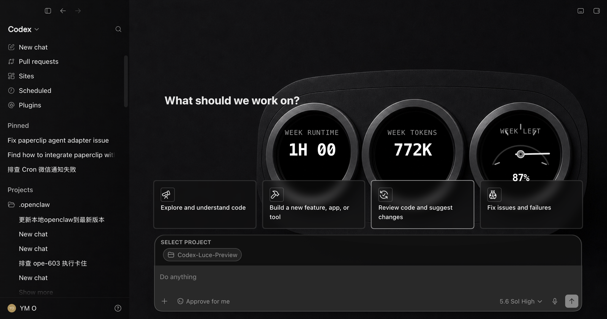
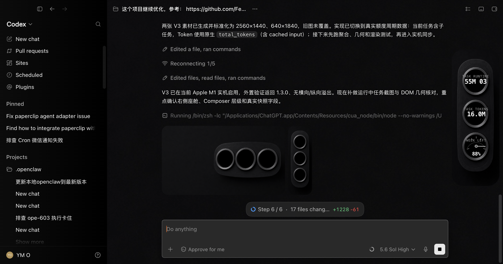
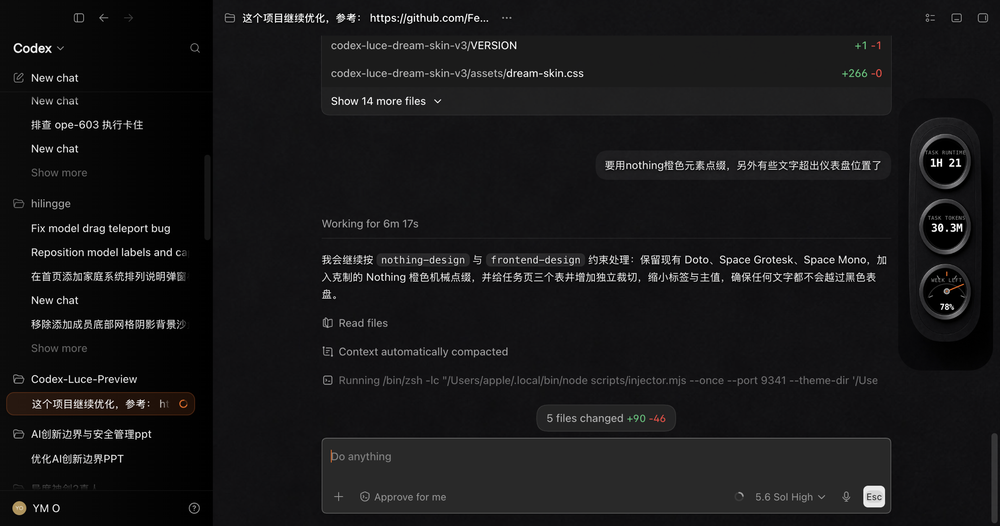
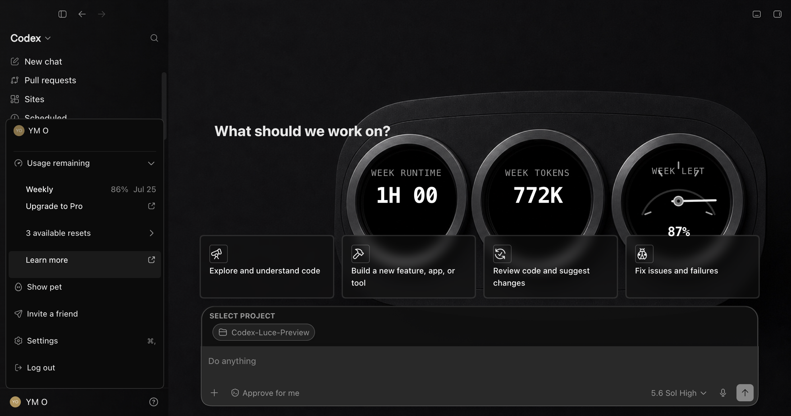
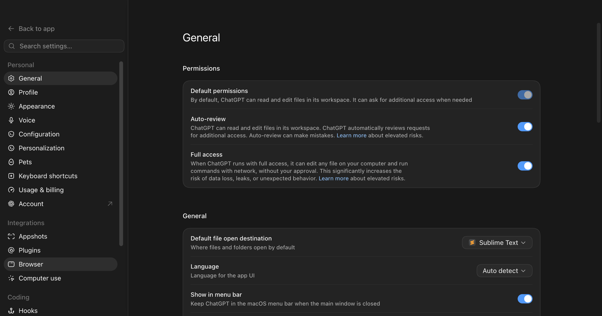

# Codex Luce

> **首个为 Codex 打造的动态三连表皮肤** — 让官方 Codex 桌面端变成一座暗色机械座舱，仪表随你的工作状态实时跳动。

<p align="center">
  <strong>Codex Luce · 动态三连表皮肤</strong><br>
  <sub>设计灵感致敬 法拉利 Luce 三连表布局 · Nothing 黑玻 / 点阵 / 机械克制美学</sub>
</p>

<p align="center">
  
</p>

<p align="center">
  <sub>↑ 首页横向三连表 · 仪表随会话上下文实时变化</sub>
</p>

---

## 这是什么

Codex Luce 把官方 Codex 桌面端（`Codex.app` / `ChatGPT.app`）渲染成一座暗色机械座舱：

- **首页**：横向三连表仪表板，三块表盘随模型 / 会话 / 上下文实时读数
- **任务页**：竖向三连表 Dock，`OUTPUT` / `ACTIVITY` / `CONTEXT` 三路工作状态一目了然
- 仪表是**只读叠加层**，原生 Codex 的输入框、按钮、卡片、侧栏全部保持真实可交互
- 整窗一层连续的暗色背景铺底，路由感知的半透明层让首页、任务、插件、定时任务、Pull Request 各页都清晰可读

<p align="center">
  
</p>

<p align="center">
  <sub>↑ 任务页竖向三连表 Dock · OUTPUT / ACTIVITY / CONTEXT 工作状态读数</sub>
</p>

## 为什么不一样

| | 传统 Codex 皮肤 | **Codex Luce** |
| --- | --- | --- |
| 仪表 | 静态贴图 / 无 | **动态三连表**，随工作状态实时读数 |
| 设计语言 | 通用换色 | 法拉利 Luce 三连表布局 + Nothing 黑玻点阵美学 |
| 原生交互 | 覆盖或替换 | **保留**，仪表只是只读叠加层 |
| 安全 | 改 app / asar / 签名 | **不改任何官方文件、不改签名** |

- 🏎️ **法拉利 Luce 致敬**：三块圆形仪表的横向 / 竖向组合布局，来自 Luce 概念座舱的三连表构图，重新映射到 AI 编程的工作流（模型、会话、上下文、输出、活动、剩余配额）。
- ⬛ **Nothing 致敬**：OLED 纯黑玻璃、橙色信号色、点阵纹理、机械克制 —— 只在需要说话的地方点亮一点。
- 🔴 **首个动态三连表皮肤**：目前公开的 Codex 皮肤里，第一个把"三连表 + 实时仪表读数"做出来的。

> 本项目为非官方个人作品，与 OpenAI、Ferrari、Nothing 均无任何隶属、赞助或代言关系，也未使用任何一方的官方 Logo、标识或产品素材。

## 设计灵感

<details>
<summary>📖 三连表与机械克制美学的来源（点击展开）</summary>

**法拉利 Luce 概念内饰 —— 三连表构图**
座舱正中以三块圆形仪表为视觉锚点，左右对称、中央承担主信息。Codex Luce 把这套构图搬到首页：三块横向表盘分别承担"模型 / 会话 / 上下文"读数，中央表盘是主角。

**Nothing —— 黑玻 · 点阵 · 机械克制**
Nothing 的工业设计语言是 Codex Luce 的材质底：OLED 纯黑玻璃、细密点阵纹理、单一橙色作为"激活/动作"信号、红色仅作为一处打断提示。能用减法的地方绝不加法，仪表只在有数据时才点亮。

Codex Luce 把两者嫁接到 AI 编程工具上：**用 Luce 的三连表构图讲故事，用 Nothing 的材质语言克制地呈现。**
</details>

## 更多界面

<p align="center">
  
</p>

<p align="center">
  <sub>↑ 三连表仪表特写 · 橙色为激活态，红色为打断信号</sub>
</p>

<table>
  <tr>
    <td width="50%" align="center"><br><sub>用量 / 配额读数</sub></td>
    <td width="50%" align="center"><br><sub>设置页皮肤适配</sub></td>
  </tr>
</table>

## 系统要求

- macOS（Apple Silicon 或 Intel）
- 已安装并至少启动过一次官方 Codex 桌面端
- `~/.codex/config.toml` 已存在
- 无需安装任何第三方 npm 包

安装器会校验并复用官方 Codex / ChatGPT 桌面端**自带且已签名**的 Node.js，所以你不必为了用这个皮肤单独装一个全局 Node。

## 快速开始

```bash
git clone https://github.com/ouxxyy/codex-luce.git
cd codex-luce

# 可选：先跑一遍本地安全检查
npm test

# 关闭 Codex，然后安装引擎并创建桌面启动器
./scripts/install-dream-skin-macos.sh --no-launch

# 启用 Codex Luce 主题
~/.codex/codex-dream-skin-studio/scripts/switch-theme-macos.sh --id preset-codex-luce

# 启动换肤后的 Codex 会话
~/.codex/codex-dream-skin-studio/scripts/start-dream-skin-macos.sh
```

安装后会创建这些稳定路径：

| 内容 | 路径 |
| --- | --- |
| 引擎 | `~/.codex/codex-dream-skin-studio` |
| 状态 / 日志 / 自定义图片 | `~/Library/Application Support/CodexDreamSkinStudio` |
| 桌面启动器 | `~/Desktop/Codex Dream Skin*.command` |

桌面启动器：

- `Codex Dream Skin.command`：启动或重新应用皮肤
- `Codex Dream Skin - Verify.command`：验证运行健康并存一张验证截图
- `Codex Dream Skin - Restore.command`：停止注入器并恢复官方外观
- `Codex Dream Skin - Customize.command`：换一张你自己的背景图

## 内置预设

Codex Luce 是主打预设：

```bash
~/.codex/codex-dream-skin-studio/scripts/switch-theme-macos.sh --id preset-codex-luce
```

仓库 [`presets/`](./presets/) 下还保留了几套抽象备用预设，但公开发布的核心就是 **Codex Luce 三连表皮肤**。

## 换你自己的背景图

```bash
~/.codex/codex-dream-skin-studio/scripts/customize-theme-macos.sh
```

推荐图片规则：

- PNG / JPEG / HEIC / TIFF / WebP
- 源图 ≤ 50 MB；处理后的主题图 ≤ 16 MB、单边 ≤ 16384 px、≤ 50 MP
- 推荐主尺寸 `2560 × 1440`（16:9）
- 左侧约 50%–58% 保持低对比、留白，给原生 Codex 内容让位
- 只用纯背景图：不要带窗口边框、按钮、可读文字、Logo 或水印的截图

进阶 CLI 示例：

```bash
~/.codex/codex-dream-skin-studio/scripts/load-image-theme-macos.sh \
  --file "/path/to/image.png" \
  --appearance auto \
  --focus-x 0.72 \
  --focus-y 0.45 \
  --safe-area left \
  --task-mode banner
```

## 菜单栏（可选）

SwiftBar 用户可以装一个菜单栏控制器，做应用 / 暂停 / 换图 / 切换主题：

```bash
./Install\ Menu\ Bar.command
```

SwiftBar 加载插件后，看右上角菜单栏的 `Skin` 即可。

## 验证与恢复

```bash
npm test
./scripts/doctor-macos.sh
./scripts/restore-dream-skin-macos.sh --restore-base-theme --restart-codex
```

`npm test` 会检查 shell 语法、JS 语法、内置预设合法性、renderer 行为、配置备份 / 恢复安全、主题暂存、菜单栏转义和注入器身份守护。

## 工作原理（安全边界）

1. 发现 `com.openai.codex`，校验签名 / Team ID / 架构 / 内置 Node
2. 通过用户级 `launchd` 启动 Codex，CDP 只绑定到 `127.0.0.1`
3. 只在端口归属于 Codex（或其合法子进程）时才接受调试端口
4. 只注入到预期的 `app://` 渲染目标
5. 解析主题与图片的真实路径，注入前强制 16 MB、单边 `16384px`、50 MP 上限
6. 用一个小型注入器在重载和路由切换间常驻
7. 暂停 / 恢复时核验 PID、可执行文件、脚本路径、启动时间全部匹配才停止；停止失败会保留状态并中止
8. 配置备份 / 恢复要求 Codex 已关闭、严格 UTF-8、操作锁、同目录原子替换、字节不变核验

**CDP 功能强大且在环回口上无鉴权。** 主题用完请优先用 Restore 恢复。

## 隐私边界

本项目刻意不携带任何本地用户数据：

- 不提交任何 Codex 任务内容
- 不提交本地 rollout 日志、备份或 Application Support 状态
- 展示截图都做了裁切，避免泄露侧栏、任务文本和本地路径
- 不需要任何 API Key、Token、Cookie 或模型供应商配置
- 主题图片分析完全在 Codex 渲染器的本地 Canvas 里完成，不上传、不调外部 API
- CDP 只绑定 `127.0.0.1`；换肤会话运行期间，请把这个本地调试端口当作敏感信息对待

贡献时请把私有文件挡在仓库外。`.gitignore` 已拦截常见的本地状态、日志、归档、截图和环境文件。

## 打包发布 ZIP

```bash
./scripts/build-release.sh
```

归档会写到 `release/codex-luce-v<version>.zip`，并附带一份 `SHA256SUMS.txt`。

## 关于 欧八同学

全网同名：**欧八同学**

这里是关于 AI 时代职业成长、副业探索和个人实践复盘的长期记录分享。

- 8 年产品经理，经历过网易、搜狐、MINISO
- 国家三级心理咨询师

我分享：

- AI 时代的职业选择思路
- 真实使用的 AI 工具方法
- 副业探索记录

X：[@albertouoo](https://x.com/albertouoo?s=11)　·　关注公众号👇

<p align="center">
  
</p>

## License

仅限非商业用途。禁止任何形式的商业使用，包括但不限于：转售、付费客户交付、SaaS / 企业使用、咨询或外包服务、商业培训产品、模板市场售卖、或与付费产品 / 服务打包捆绑。

详见 [`LICENSE`](./LICENSE)。商标、运行时边界与捆绑素材的额外声明见 [`NOTICE.md`](./NOTICE.md)。

---

<p align="center">
  <sub>喜欢这个三连表皮肤？欢迎 ⭐ Star · 它会让更多 Codex 用户看到。</sub>
</p>
